# INVOICEKU

Modern Invoice Management Web Application built with CodeIgniter 3.


---

## Features

### Authentication
- Login system
- Logout
- Session management

### Dashboard
- Customer statistics
- Invoice statistics
- Revenue summary
- Paid / Pending / Overdue analytics
- Recent invoices

### Customer Management
- Create customer
- Edit customer
- Delete customer
- Search & pagination
- Delete validation if customer already has invoices

### Invoice System
- Create invoice
- Add invoice items
- Edit invoice items
- Delete invoice items
- Invoice detail page
- Due date support
- Automatic overdue status
- Export CSV
- PDF Invoice export using Dompdf

### Activity Log / History
- Login/logout activity
- Customer activity
- Invoice activity
- User activity
- Search & filter
- Pagination
- Delete logs

### User Management & Role System
Roles:
- Admin
- Staff

Permissions:
- Admin full access
- Staff restricted access

Features:
- Add user
- Edit user
- Delete user
- Search & pagination
- User statistics

---

## Tech Stack

- CodeIgniter 3
- Bootstrap 4
- MySQL / MariaDB
- Dompdf
- Apache

---

## Screenshots

### Login Page

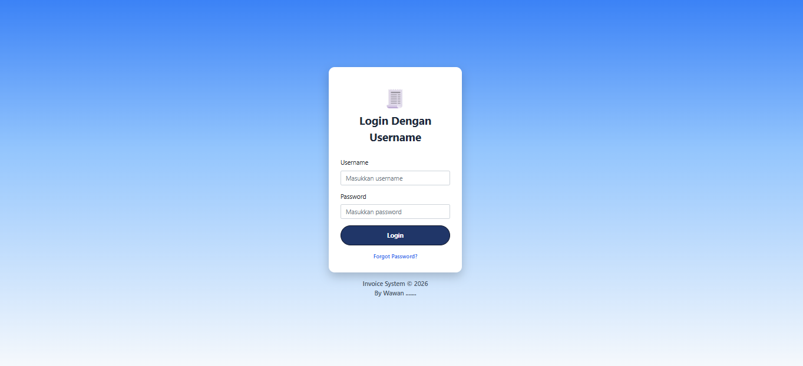

---
---
### Reset Password

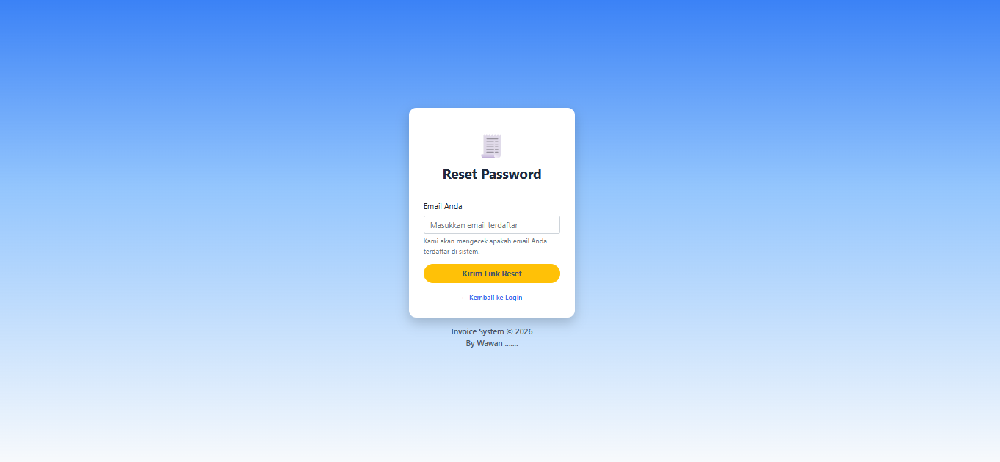   

---
### Dashboard

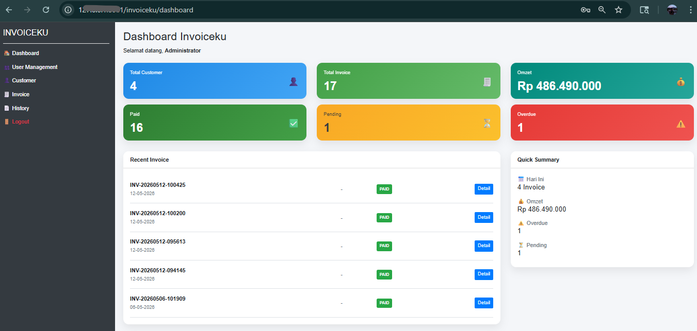

---

### User Management

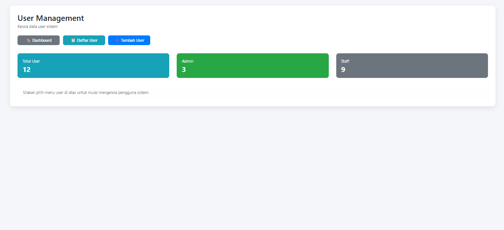

---

### Add User

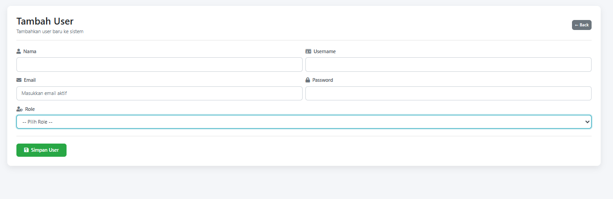

---

### User List

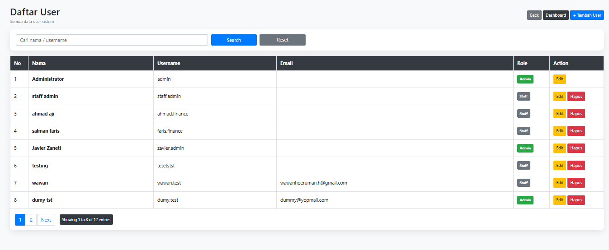

---

### Customer Management

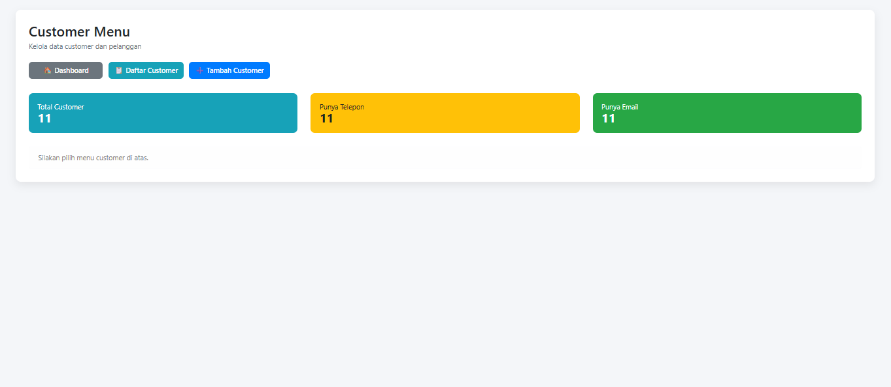

---

### Add Customer

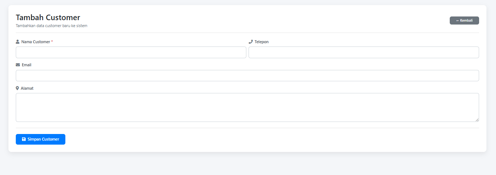

---

### Customer List

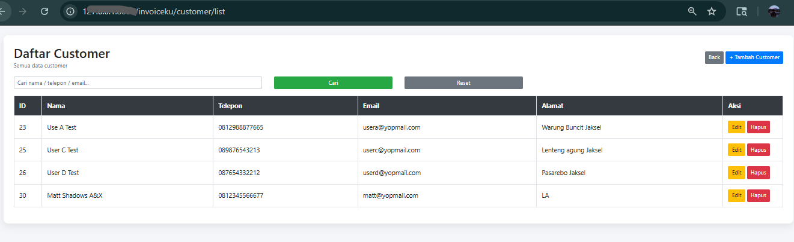

---

### Invoice Management

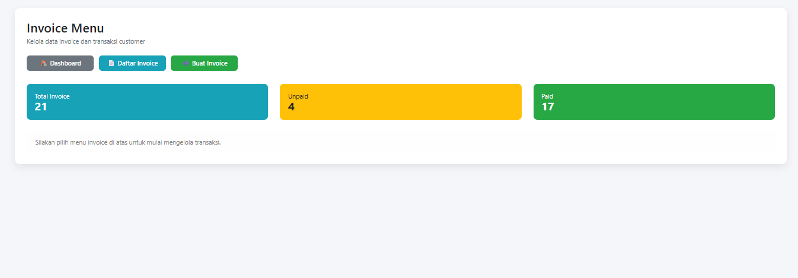

---

### Invoice List

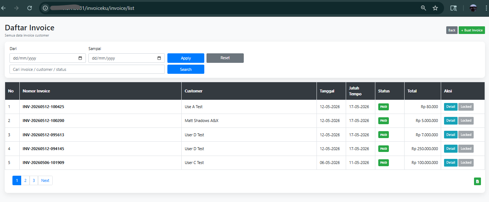

---

### Create Invoice

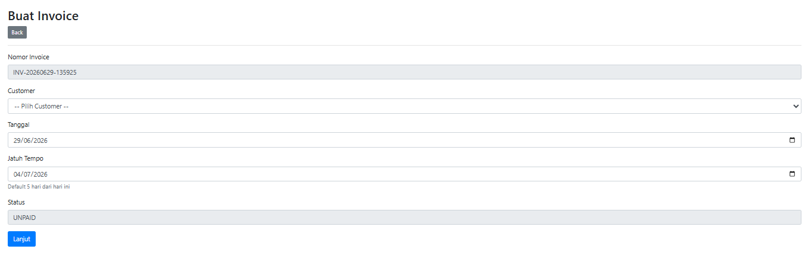

---

### Invoice Detail Create

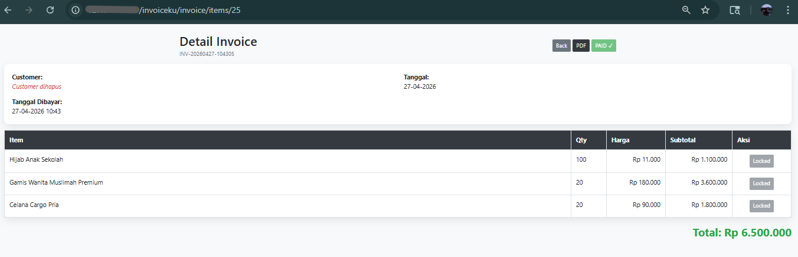

---

### Invoice PDF

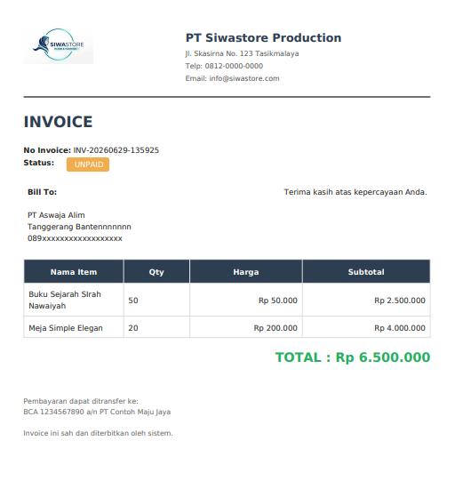

---

### Activity Log

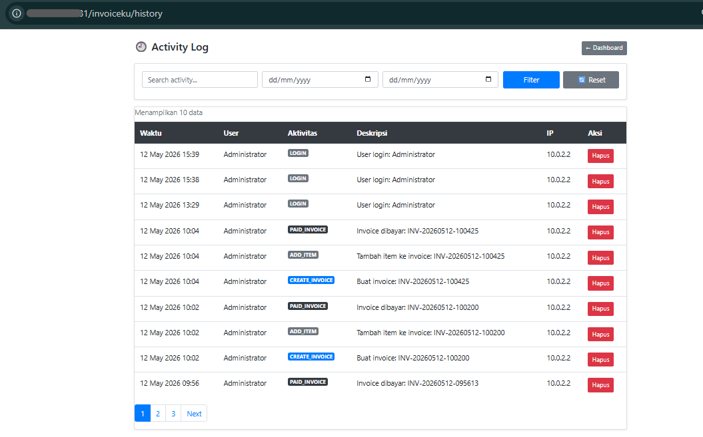

---

## Installation

### Clone Repository

```bash
git clone https://github.com/wawanhoeruman/invoiceku.git
```

---

### Configure Database

Edit:

```bash
application/config/database.php
```

---

### Import Database

Import:

```bash
database/invoiceku.sql
```

---

### Run Project

Move project into Apache/XAMPP/LAMP directory.

Example:

```bash
/var/www/html/invoiceku
```

Then open:

```bash
http://localhost/invoiceku
```

---

## Current Version

```text
v1.0.0
```

---

## Future Improvements

- REST API
- Email invoice
- Dark mode dashboard
- AJAX dashboard analytics
- Docker support
- CI/CD deployment
- Multi-company support

---

## Author

Wawan Hoeruman

GitHub:
https://github.com/wawanhoeruman
